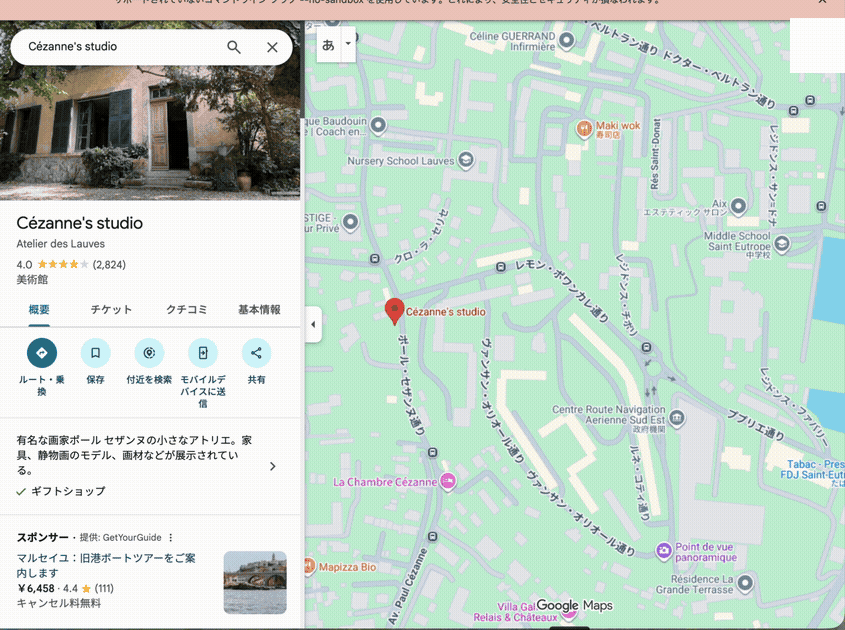

# maps-list-saver

Bulk-save a plain-text list of places into your **Google Maps saved lists** ("Want to go", "Favorites", or any custom list) by automating the Maps web UI with Playwright.

Google has never offered a write API for personal saved lists ([feature request open since 2017](https://issuetracker.google.com/issues/68749469)), so saving 30 places for a trip means 30 rounds of search-tap-save on your phone. This tool does that clicking for you, in your own browser, with your own session.

## Demo

The CLI — resolve free-text names, review, then save (2× speed):


The browser doing the clicking — each place saved into the target list (2× speed):



## How it works

```
places.txt ──resolve──▶ resolved.tsv ──save──▶ results.tsv
(one place            (canonical Maps         (append-only log;
 per line)             URLs — review           reruns skip
                       before saving!)         what succeeded)
```

Small Unix-style steps connected by TSV files:

- **resolve** turns free-text names into canonical Google Maps place URLs. Ambiguity is caught here — review `resolved.tsv` before saving so a wrong match never reaches your list.
- **save** opens each place and clicks Save → your list. Every outcome is appended to `results.tsv`, so an interrupted or partially failed run can simply be rerun; finished places are skipped.
- Your Google credentials are never seen by this tool. A dedicated Chrome profile is used: you log in once by hand, the session persists.

## Requirements

- Node.js 20+
- Google Chrome installed (the tool drives real Chrome, not bundled Chromium — set `MAPS_LIST_SAVER_CHANNEL` to override)

## Usage

```bash
pnpm install && pnpm build

# 1. one-time: log in to Google in the dedicated profile, then close the browser
node dist/cli.js login

# 2. write your list
cat > places.txt <<'EOF'
# Taipei trip
九份老街
士林夜市
Taipei 101
EOF

# 3. resolve names to canonical Maps URLs, then REVIEW the output
node dist/cli.js resolve places.txt -o resolved.tsv
cat resolved.tsv

# 4. save everything into a list (create the list in Google Maps first)
node dist/cli.js save resolved.tsv --list "行ってみたい"
```

Add `--headless` to `resolve` or `save` to run without a visible browser window. Headed is the default because Google is more likely to flag headless sessions as automated — if a headless run suddenly behaves as signed out, drop the flag.

`resolved.tsv` columns: `query`, `resolved name`, `url`. Delete or fix rows that resolved to the wrong place before running `save`.

Failed saves are logged to `results.tsv` with the error; rerunning the same `save` command retries only the failures.

## Limitations

- If a place is already saved in *any* list, it is recorded as `already` and skipped — v1 does not check *which* list.
- Google Maps UI changes will break the selectors (`src/save.ts`, `src/resolve.ts`). PRs welcome.
- Saves run serially with randomized 2–5 s delays on purpose. Don't remove them.

## Disclaimer

This tool automates the Google Maps web UI, which may conflict with Google's Terms of Service regarding automated access. It performs only actions you could do by hand, at a human pace, on your own account — but **use it at your own risk**: any account restriction is on you. Intended for personal use with your own place lists. Do not use it for scraping, spam, or bulk operations on accounts that are not yours.

## License

MIT
